## 问题复现：
​
出现在isulad和debian系操作系统(eg.centos、openeuler)上，edgecore运行一段时间后bin目录被删除。
​
## 恢复方式：
​
 ```
ln -s /usr/bin /bin
```
​
## 问题排查：

参考文章：https://blog.csdn.net/weixin_30229705/article/details/113051178

修改edgecore编译方式以及使用bpftrace抓取内核删除函数打印用户调用栈：

```c
bin deleted by command 'edgecore' with pid 55978 
    48a9db syscall.Syscall.abi0+27 (/usr/local/bin/edgecore)
    4b8445 os.Remove+69 (/usr/local/bin/edgecore)
    1a33fd7 k8s.io/kubernetes/pkg/kubelet/container.(*RealOS).Remove+55 (/usr/local/bin/edgecore)
    1f1008e k8s.io/kubernetes/pkg/kubelet/logs.(*containerLogManager).Clean+974 (/usr/local/bin/edgecore)
    1f32275 k8s.io/kubernetes/pkg/kubelet/kuberuntime.(*kubeGenericRuntimeManager).removeContainerLog+85 (/usr/local/bin/edgecore)
    1f32195 k8s.io/kubernetes/pkg/kubelet/kuberuntime.(*kubeGenericRuntimeManager).removeContainer+405 (/usr/local/bin/edgecore)
    1f34899 k8s.io/kubernetes/pkg/kubelet/kuberuntime.(*containerGC).removeOldestN+409 (/usr/local/bin/edgecore)
    1f355f1 k8s.io/kubernetes/pkg/kubelet/kuberuntime.(*containerGC).evictContainers+433 (/usr/local/bin/edgecore)
    1f36c7d k8s.io/kubernetes/pkg/kubelet/kuberuntime.(*containerGC).GarbageCollect+61 (/usr/local/bin/edgecore)
    1f4227d k8s.io/kubernetes/pkg/kubelet/kuberuntime.(*kubeGenericRuntimeManager).GarbageCollect+29 (/usr/local/bin/edgecore)
    1a2d462 k8s.io/kubernetes/pkg/kubelet/container.(*realContainerGC).GarbageCollect+98 (/usr/local/bin/edgecore)
    201b1af k8s.io/kubernetes/pkg/kubelet.(*Kubelet).StartGarbageCollection.func1+79 (/usr/local/bin/edgecore)
    98a687 k8s.io/apimachinery/pkg/util/wait.BackoffUntil.func1+103 (/usr/local/bin/edgecore)
    98a516 k8s.io/apimachinery/pkg/util/wait.BackoffUntil+182 (/usr/local/bin/edgecore)
    98a409 k8s.io/apimachinery/pkg/util/wait.JitterUntil+137 (/usr/local/bin/edgecore)
    98a345 k8s.io/apimachinery/pkg/util/wait.Until+37 (/usr/local/bin/edgecore)
    201b12e k8s.io/kubernetes/pkg/kubelet.(*Kubelet).StartGarbageCollection.dwrap.1+46 (/usr/local/bin/edgecore)
    4727a1 runtime.goexit.abi0+1 (/usr/local/bin/edgecore)
```

通过日志分析可知，bin目录是通过edgecore——>kubelet.StartGarbageCollection——>kubelet/logs/中的Clean方法调用Remove删除

### 源码追踪：

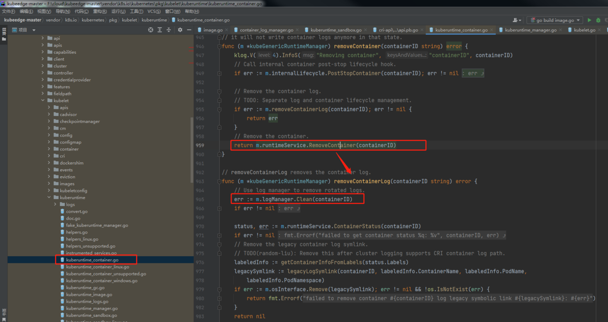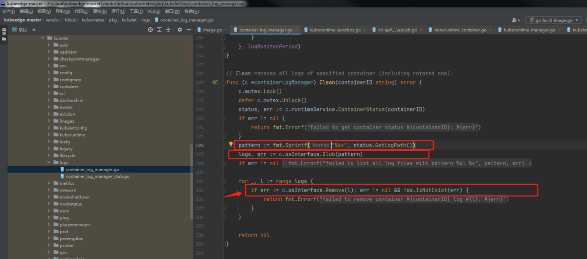

从调用关系看出，这里的操作是在删除容器，删除容器日志文件，问题就出在当删除容器日志文件时将bin目录删除误删除了。

从Remove函数可以看出，这里删除了bin目录,说明l变量为"bin",l变量的取值是根据logs中获取，logs是根据Glob(pattern）匹配而来，说明这里的pattern有问题，pattern是根据status.GetLogPath()获取。猜测问题出在status.GetLogPath()，status.GetLogPath()取的值是容器的日志路径：

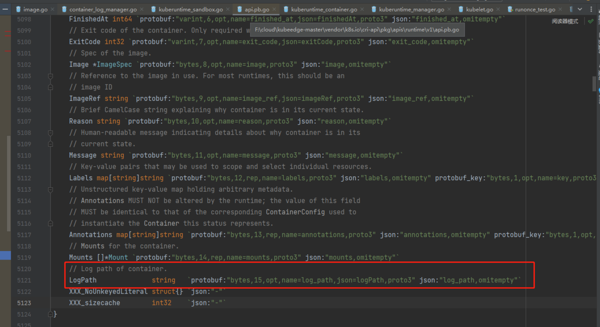

为了验证猜测，在Clean函数中添加打印日志，分别打印status.GetLogPath()，pattern,l变量：

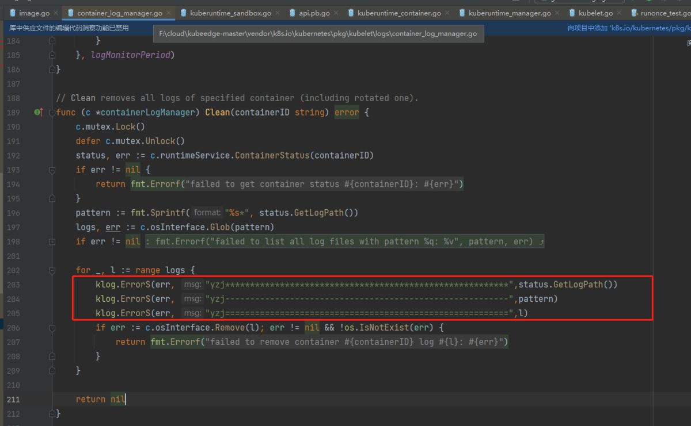

重新编译edgecore，然后启动edgecore，通过journalctl -xeu edgecore获取edgecore的日志，从中发现status.GetLogPath()，pattern,l变量均为空。

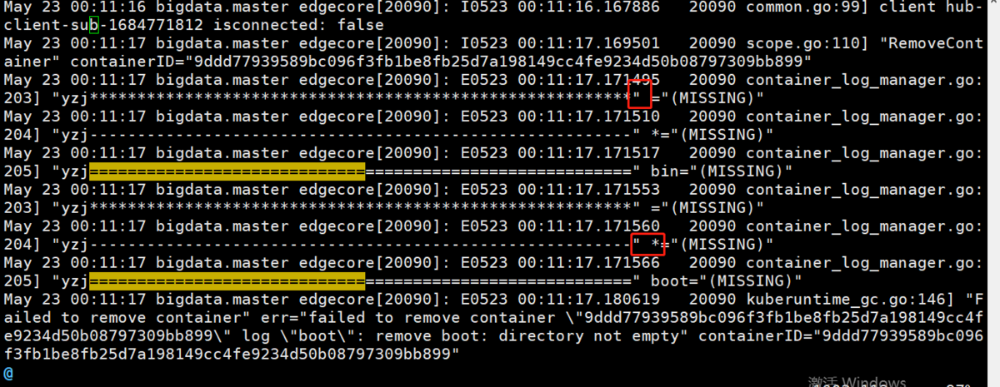

通过isula ps -a获取所有容器，并结合日志找出是删除哪个容器的日志目录时出现了容器日志目录为空的情况，从下图中发现被删除的容器是mqtt。

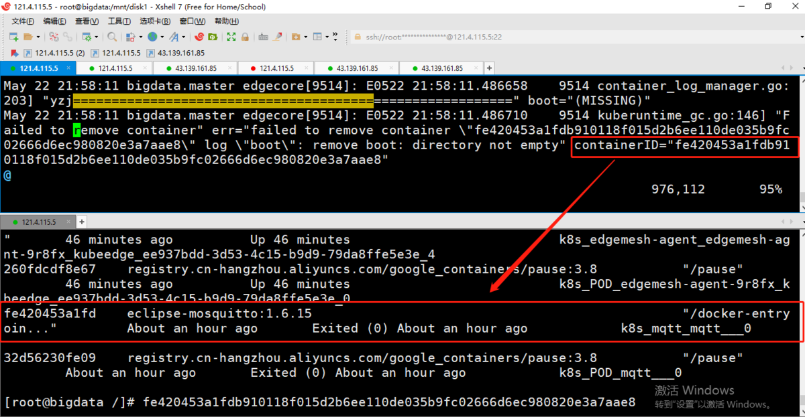

通过crictl --runtime-endpoint unix:///run/isulad.sock inspect b24e798b43a7获取mqtt容器的inspect信息。从而发现logPath为空，从而说明通过容器运行时CRI接口访问isula的容器运行时得到的logPath为空。

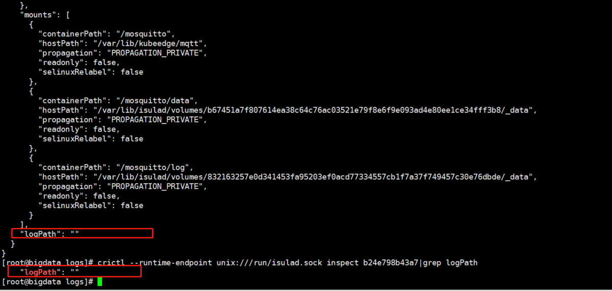

接下来分析logPath是由kubelet创建的还是容器运行时创建的，如果是kubelet创建的那么就是kubelet将logPath传给容器运行时，如果是容器运行时创建的则说明是容器运行时出问题了。

通过分析源码 ContainerStatus 的LogPath的取值可以发现是通过CRI接口获取，即这里是从容器运行时获取的logPath。
通过阅读kubelet源码，创建pod时会调用syncPod函数，syncPod会创建沙箱pod，在远程调用容器运行时创建沙箱pod前，会先创建pod的日志目录，但是只会创建到/var/log/pods/<podUID>/层，这个参数在PodSandboxConfig.LogDirectory中，而剩下的日志目录层在ContainerConfig.LogPath中，将两个目录叠加到一起，才是pod的日志目录。

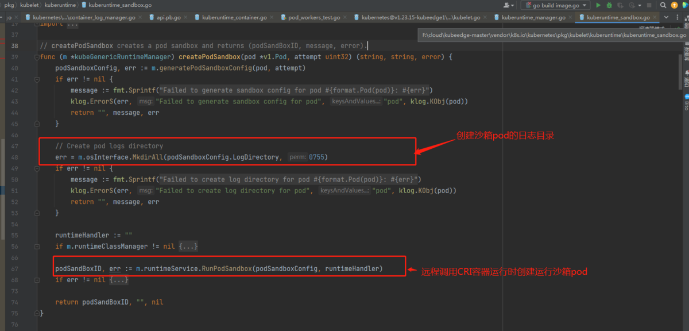
那么容器日志目录ContainerConfig.LogPath在哪里创建的呢？继续往下就是启动普通容器了，会调用startContainer函数，而容器日志目录就是在startContainer函数函数中创建

pod的最终日志全路径最后一层是容器重启次数+.log软链接到容器的真实日志路径，这个软链接创建是在容器运行时里做，kubelet会将pod的日志路径下发给容器运行时，由容器运行时将pod日志路径软连接到容器的真实日志路径。


最终可以得出沙箱pod和容器的日志目录均是由kubelet创建，并传递给容器运行时的，但为什么mqtt的沙箱pod目录和容器的日志目录都是空的？猜测mqtt的pod并不是通过kubelet创建，因为mqtt的pod通过kubectl在master中心节点上并查询不到，mqtt是通过keadm join过程中创建的，故需要分析这一部分的源码。

maqtt启动时的源码位置如下，可以发现mqtt是直接通过调用容器运行时创建的，继续跟踪源码查看远程调用容器运行时前，传递了的哪些参数给CRI接口。发现沙箱pod的配置结构体runtimeapi.PodSandboxConfig中并没有传递LogDirectory 参数；同时runtimeapi.ContainerConfig结构体中也没有传递LogPath，所以这两个参数下发到容器运行时均为空，问题的源头就在这里了。

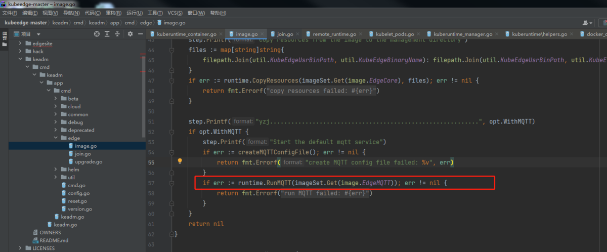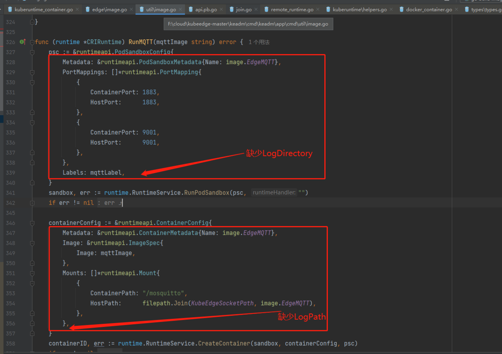

### 临时规避问题

问题总结：kubeedge版本大于1.9.5时，mqtt均采用容器方式运行，但目前mqtt通过直接调用CRI接口创建容器，不存在沙箱pod的LogDirectory和容器日志路径LogPath下发，导致当容器一旦启动失败，kubeedge调用kubelet清理pod日志路径时读到的路径为空，进而导致通过Glob(pattern）函数误得到bin和boot目录，最终导致误删了bin和boot目录，但boot目录存在子目录和文件，并不能删除成功，进而一直报错boot删除失败，容器也会一直删不成功。

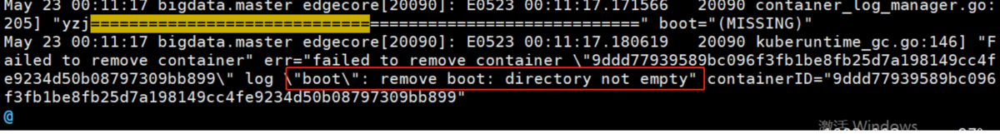

临时解决办法：在加入边缘节点的token命令后添加参数\--with-mqtt=false，然后在宿主机上手动安装mosquitto，或者采用kubeedge版本<=1.9.5。

### 附文件
- [edgecore.log](../images/keadm_mqtt/edgecore.log)
- [bpftrace.log](../images/keadm_mqtt/bpftrace.log)